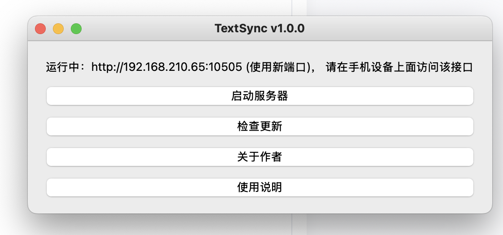

# TextSync

TextSync 是一款轻量的本地/局域网文本与文件同步工具，设计目标是简单、安全、无需第三方账号或云服务。它可以在本机启动一个小型 HTTP 服务，允许局域网内或本机上的设备通过浏览器访问页面进行文本实时同步和文件上传/下载。

---

## 设计理念

- 本地优先（Local-first）：默认将数据存储在用户机器（`~/Downloads/TextSync`）下，所有文件通过本地静态路由直接访问；不把用户数据发送到第三方服务器。
- 最小权限：无需登录微信或任何第三方账号。通过本地网络直接传输数据，隐私友好。
- 简单易用：提供桌面启动器（PySide6），以及一个轻量的网页前端，支持二维码快速打开移动端页面。
- 可发布：提供 PyInstaller 打包脚本与 macOS DMG 生成支持，便于分发给最终用户。

---

## 前端使用说明（网页端）

- 文本编辑器会自动保存：停止输入 700ms 后保存。
- 页面每 2 秒会拉取一次服务器以保持同步（可在页面上点击“同步”手动拉取）。
- 文件上传支持拖放或手动选择，上传完成后文件会出现在文件列表，可直接点击“下载/打开”。
- 页面右上可显示服务器标识（hostname 或 IP），点击可复制服务器地址；还支持生成二维码方便移动设备扫码打开。


---

## 桌面程序行为

- `main.py` 使用 PySide6 提供一个小窗口，用来启动/管理内置的 uvicorn server。窗口上有：
	- 启动服务器 按钮
	- 检查更新 / 关于作者 / 使用说明（弹窗）
- 关闭窗口时会询问是否删除运行时目录下的数据（`files/` 和 `data.db`）。



运行时目录（可通过环境变量覆盖）：

```
# 默认：~/Downloads/TextSync
SYNC_DIR 环境变量可覆盖路径
```

数据库文件与上传文件会存放到该运行时目录。

---

## 常见问题与排查

- 按钮不可点击：在浏览器控制台检查 `window.SYNC_DOWNLOAD_URL` 是否存在；或用 curl 查看首页是否包含注入脚本：

```bash
curl -s http://127.0.0.1:8000/ | grep SYNC_DOWNLOAD_URL || true
```

- 页面加载慢或资源未更新：尝试清除浏览器缓存或强刷（Cmd/Ctrl+Shift+R）。
- 打包后 `.app` 无法运行或缺少依赖：建议在干净的虚拟环境或干净机器上构建，检查 PyInstaller 的 hidden-imports 列表，并查看 `dist/<App>/` 中的日志和 `warn-*.txt` 文件。

---

## 安全与隐私说明

TextSync 遵循“本地优先”原则。默认情况下：

- 所有传输均在本地网络或本机发生；不会自动将文件或文本上传到任何第三方服务器。
- 如果你在 `server.py` 中配置了外部 `HARDCODED_DOWNLOAD_URL` 或在 `config.json` 中设置外部 URL，那个链接可能会将用户引导到第三方站点，请确保该链接的安全与隐私策略符合你的需求。

---

## 贡献与联系方式

如果你希望贡献代码或提出问题，请在仓库中创建 Issue 或 Pull Request。作者/维护者：ljm5000。

---

## 许可证

（在此处填写许可证，例如 MIT 或你选择的其他许可证）

# TextSync
## 使用背景
为了让多端同步文字，而且我也不希望使用微信/qq, 毕竟要在陌生电脑登录， 这个我比较反感，所以开发了这么一个小工具
## 使用方式
1. 点击启动按钮
2. 在需要同步的设备上打开浏览器，并且访问即可
